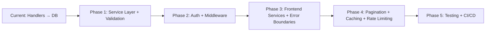

# MasteryPath — Architecture Improvement Suggestions

> AI-generated review based on codebase analysis against industry best practices from leading open-source projects (Fiber examples, Expo starter templates, production Go APIs).

## 🔴 High Priority

### 1. Add Service Layer Between Handlers and Database
**Current**: Handlers directly call `mongo.Collection` methods.
**Problem**: Business logic is coupled to HTTP layer; untestable without spinning up a DB.
**Suggestion**: Introduce `internal/services/` with interfaces.

```diff
+ internal/services/
+   ├── goal_service.go      // GoalService interface + implementation
+   ├── skill_service.go     // SkillService interface + implementation
+   └── progress_service.go  // ProgressService interface + implementation
```

```go
// Example service interface — makes handlers testable with mocks
type GoalService interface {
    GetAll(ctx context.Context) ([]models.Goal, error)
    GetByID(ctx context.Context, id primitive.ObjectID) (*models.Goal, error)
    Create(ctx context.Context, goal *models.Goal) error
    Update(ctx context.Context, id primitive.ObjectID, goal *models.Goal) error
    Delete(ctx context.Context, id primitive.ObjectID) error
}
```

**Referenced in**: `go-clean-arch` by bxcodec, `fiber-boilerplate` by thomasvvugt.

---

### 2. Add Structured Error Handling
**Current**: Each handler returns ad-hoc `fiber.Map{"error": "..."}` with inconsistent status codes.
**Suggestion**: Create `internal/apperror/` with typed errors.

```go
// internal/apperror/errors.go
type AppError struct {
    Code    int    `json:"code"`
    Message string `json:"message"`
    Detail  string `json:"detail,omitempty"`
}

var (
    ErrNotFound      = &AppError{Code: 404, Message: "Resource not found"}
    ErrInvalidBody   = &AppError{Code: 400, Message: "Invalid request body"}
    ErrInvalidID     = &AppError{Code: 400, Message: "Invalid ID format"}
    ErrInternal      = &AppError{Code: 500, Message: "Internal server error"}
)
```

Plus a Fiber error handler middleware to catch and format all errors consistently.

---

### 3. Fix Silently Ignored ObjectID Parsing Errors
**Current**: Several handlers ignore `ObjectIDFromHex` errors:
```go
objID, _ := primitive.ObjectIDFromHex(id) // Error ignored!
```
**Files**: `skill_handler.go` (lines 125, 165, 212, 291), `progress_handler.go` (lines 66, 121, 160)
**Fix**: Always check and return 400 Bad Request with a descriptive error.

---

### 4. Add Authentication & Authorization (JWT)
**Current**: API is completely open — no auth.
**Suggestion**: Implement JWT middleware using `gofiber/jwt` or `golang-jwt/jwt`.

```
internal/
  ├── middleware/
  │   ├── auth.go          // JWT validation middleware
  │   └── cors.go          // Extracted CORS config
  ├── models/
  │   └── user.go          // User model
  └── handlers/
      └── auth_handler.go  // Login, Register, Refresh
```

---

### 5. Frontend: Extract API Layer to Services Directory
**Current**: API functions (`fetchGoals`, `createGoalApi`, etc.) are defined inline in screen files.
**Suggestion**: Create `frontend/services/` for API separation.

```
frontend/services/
  ├── api.ts               // Axios instance with base URL, interceptors
  ├── goalService.ts       // Goal CRUD operations
  ├── skillService.ts      // Skill operations
  └── progressService.ts   // Progress operations
```

**Referenced in**: Expo official examples, React Native community templates.

---

## 🟡 Medium Priority

### 6. Add Request Validation Middleware
**Current**: Only `ProgressItem.ValidateWeightage()` exists. No validation for Goals or Skills.
**Suggestion**: Use a validation library or add model-level validation methods.

```go
func (g *Goal) Validate() error {
    if strings.TrimSpace(g.Title) == "" {
        return errors.New("title is required")
    }
    if len(g.Title) > 200 {
        return errors.New("title must be under 200 characters")
    }
    return nil
}
```

---

### 7. Add Pagination to List Endpoints
**Current**: `GetGoals` and `GetSkills` fetch ALL documents.
**Suggestion**: Add cursor-based or offset pagination.

```go
// Query params: ?page=1&limit=20
page, _ := strconv.Atoi(c.Query("page", "1"))
limit, _ := strconv.Atoi(c.Query("limit", "20"))
opts := options.Find().SetSkip(int64((page-1) * limit)).SetLimit(int64(limit))
```

---

### 8. Use Context from Request, Not `context.Background()`
**Current**: All DB calls use `context.Background()`.
**Suggestion**: Use `c.Context()` from Fiber (or `c.UserContext()`) for proper timeout/cancellation propagation.

```diff
- cursor, err := h.collection.Find(context.Background(), bson.M{})
+ cursor, err := h.collection.Find(c.UserContext(), bson.M{})
```

---

### 9. Frontend: Add Skeleton Loading & Error Boundaries
**Current**: Simple `ActivityIndicator` for loading, basic error text.
**Suggestion**: Add shimmer/skeleton screens and React Error Boundaries for a premium feel.

---

### 10. Add Logging with Structured Logger
**Current**: Uses `log.Println` and `log.Fatal`.
**Suggestion**: Use `slog` (Go 1.21+, now production-stable) for structured JSON logging.

```go
import "log/slog"

slog.Info("Server starting", "port", cfg.Port)
slog.Error("Database query failed", "error", err, "collection", "goals")
```

---

## 🟢 Low Priority / Nice-to-Have

### 11. Add Rate Limiting and Security Headers
Use Fiber's built-in `limiter` and `helmet` middleware.

### 12. Add Health Check Endpoint
```go
app.Get("/health", func(c *fiber.Ctx) error {
    return c.JSON(fiber.Map{"status": "ok", "timestamp": time.Now()})
})
```

### 13. Docker: Update Base Image to Match Go Version
**Current**: `FROM golang:1.21-alpine` — doesn't match `go.mod` (1.25.5).
**Fix**: `FROM golang:1.25-alpine AS builder`

### 14. Frontend: Add Query Key Factory Pattern
```typescript
export const goalKeys = {
    all: ['goals'] as const,
    detail: (id: string) => ['goals', id] as const,
};
```

### 15. Add MongoDB Connection Pooling Configuration
Set `MaxPoolSize`, `MinPoolSize`, `MaxIdleTimeMS` in connection options.

### 16. Cascade Delete for Skills
**Current**: Deleting a parent skill orphans children.
**Suggestion**: Either prevent deletion of parents or cascade-delete descendants.

### 17. Frontend: Add `UpdatedAt` Field to Models
Backend `Goal` model lacks an `updated_at` field. Consider adding this to track modification times.

### 18. Add Graceful Shutdown
```go
c := make(chan os.Signal, 1)
signal.Notify(c, os.Interrupt, syscall.SIGTERM)
go func() {
    <-c
    log.Println("Shutting down...")
    app.Shutdown()
}()
```

---

## Architecture Roadmap Summary


