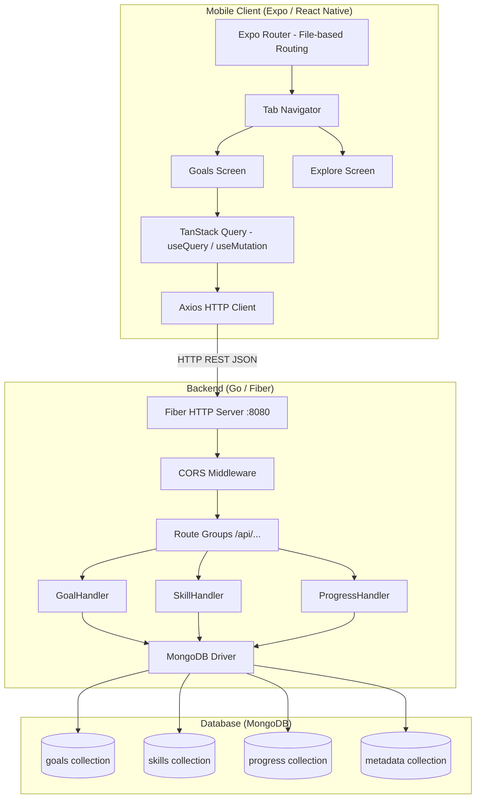

# MasteryPath — Deep Project Context

> For AI assistants: Read this file to understand the complete architecture, data flow, design decisions, and code patterns used in the MasteryPath project.

## 1. System Architecture



## 2. Data Models & Relationships

### Goal
```go
// Simple flat entity — no relationships
type Goal struct {
    ID          ObjectID  `json:"id,omitempty" bson:"_id,omitempty"`
    Title       string    `json:"title" bson:"title"`
    Description string    `json:"description" bson:"description"`
    Completed   bool      `json:"completed" bson:"completed"`
    CreatedAt   time.Time `json:"created_at" bson:"created_at"`
}
```

### Skill (Hierarchical — Materialized Path Pattern)
```go
type Skill struct {
    ID          ObjectID   `json:"id,omitempty" bson:"_id,omitempty"`
    Ancestors   []ObjectID `json:"ancestors" bson:"ancestors"`      // Materialized path
    Name        string     `json:"name,omitempty" bson:"name,omitempty"`
    Category    string     `json:"category,omitempty" bson:"category,omitempty"`
    Description string     `json:"description" bson:"description"`
    CreatedAt   time.Time  `json:"created_at" bson:"created_at"`
    ParentID    *ObjectID  `json:"parent_id" bson:"parent_id"`      // Nullable pointer
}
```
**Key Pattern**: `Ancestors` stores the full path from root to parent. A child's ancestors = parent's ancestors + parent's ID. This enables single-query tree fetching via `{ancestors: rootID}`.

### ProgressItem (Fibonacci Weighted)
```go
type ProgressItem struct {
    ID            ObjectID `json:"id,omitempty" bson:"_id,omitempty"`
    ParentSkillID ObjectID `json:"parent_skill_id" bson:"parent_skill_id"` // FK to skills
    Name          string   `json:"name" bson:"name"`
    Achieved      bool     `json:"achieved" bson:"achieved"`
    Weightage     int      `json:"weightage" bson:"weightage"`             // 1,3,5,8,13,21
    Comments      string   `json:"comments" bson:"comments"`
    WeightPercent float64  `json:"weight_percent,omitempty" bson:"-"`      // Computed, not stored
}
```
**Key Pattern**: Weightage uses Fibonacci values for relative sizing. `WeightPercent` is computed server-side via MongoDB's `$setWindowFields` aggregation.

### Metadata (Category Validation)
```go
// Stored in 'metadata' collection
// filter: {type: "SKILL_CATEGORY", value: "categoryName", is_active: true}
```

## 3. Backend Patterns in Detail

### Constructor Injection
```go
// In main.go — create handler with collection
goalHandler := handlers.NewGoalHandler(coll)

// Handler stores the collection reference
type GoalHandler struct {
    collection *mongo.Collection
}
```

### Response Patterns
- **Success list**: Return `[]Model` (always initialize to empty `[]`, never `nil`)
- **Success single**: Return the model object directly
- **Success mutation**: Return `fiber.Map{"message": "..."}` or the mutated object
- **Error**: Return `c.Status(code).JSON(fiber.Map{"error": "message"})`

### Aggregation Pipeline (Progress)
Uses `$setWindowFields` to compute total weight across all items for a skill, then `$addFields` to calculate each item's percentage within a single pipeline — no application-level math needed.

### Cascade Updates (Skills)
When a skill's `parent_id` changes, the handler:
1. Computes new ancestors from the new parent
2. Finds all descendants (`{ancestors: skilID}`)
3. Updates each descendant's ancestors array by splicing

## 4. Frontend Patterns in Detail

### State Management Strategy
| State Type | Solution | Example |
|-----------|----------|---------|
| Server state | TanStack Query | Goal list, skill data |
| UI form state | `useState` | Input fields, editing state |
| Theme/System | React Context | Color scheme |
| Navigation | Expo Router | File-based routing |

### Query Key Convention
```typescript
// Current: Simple string arrays
queryKey: ['goals']
queryKey: ['skills']
queryKey: ['progress', skillId]
```

### Optimistic Update Pattern (Goals Toggle)
```typescript
onMutate: async (updatedGoal) => {
    await queryClient.cancelQueries({ queryKey: ['goals'] });
    const previousGoals = queryClient.getQueryData<Goal[]>(['goals']);
    queryClient.setQueryData<Goal[]>(['goals'], (old) =>
        old?.map((g) => (g.id === updatedGoal.id ? updatedGoal : g))
    );
    return { previousGoals };
},
onError: (_err, _updatedGoal, context) => {
    queryClient.setQueryData(['goals'], context?.previousGoals); // Rollback
},
onSettled: () => {
    queryClient.invalidateQueries({ queryKey: ['goals'] }); // Refetch
},
```

### Component Pattern
All screens are functional components exported as default. Styles use `StyleSheet.create()` at the bottom of each file. No external styling library (no NativeWind, no Tamagui).

## 5. Database Indexes (Recommended)

```javascript
// skills collection
db.skills.createIndex({ "ancestors": 1 })      // For tree queries
db.skills.createIndex({ "parent_id": 1 })       // For parent lookups
db.skills.createIndex({ "category": 1 })         // For category filtering

// progress collection
db.progress.createIndex({ "parent_skill_id": 1 }) // For skill-based queries

// metadata collection
db.metadata.createIndex({ "type": 1, "value": 1, "is_active": 1 })
```

## 6. Salesforce Component

The `salesforce/` directory contains a standalone Apex trigger pattern:
- **Trigger**: `AccountPreventDelete.trigger` — fires before Account deletion
- **Handler**: `AccountPreventDeleteHandler.cls` — contains the business logic
- **Test**: `AccountPreventDeleteTest.cls` — test coverage

This follows the Salesforce "one trigger per object" best practice with a handler class for logic separation.
